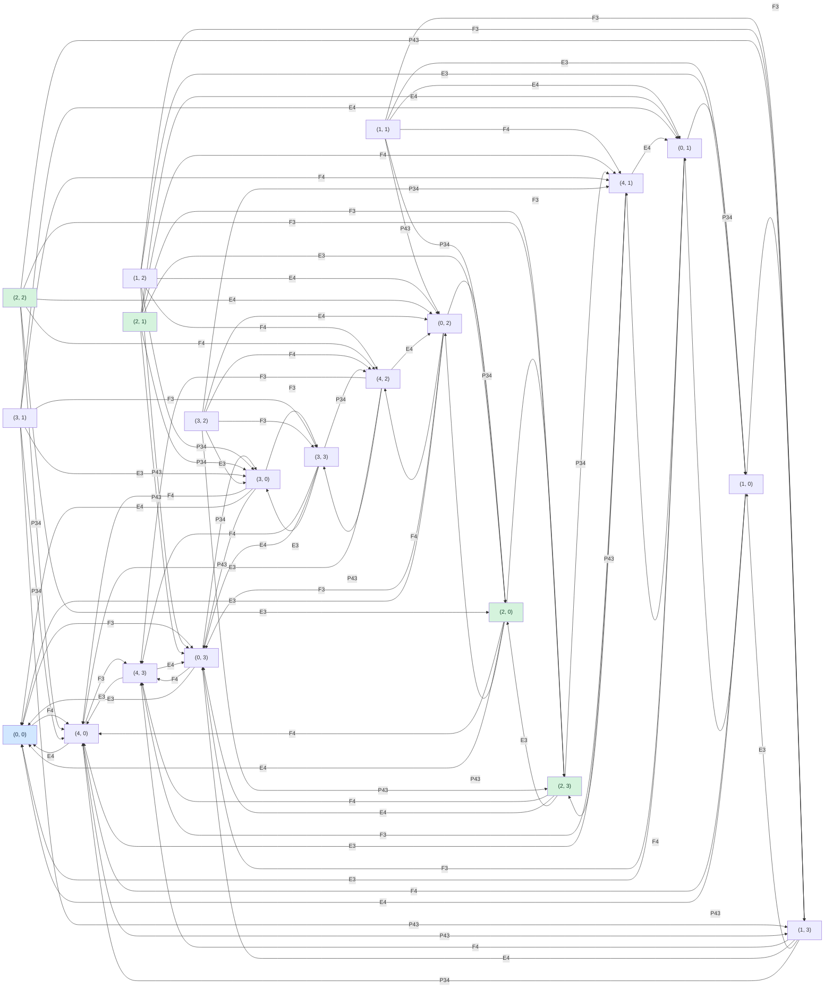

# Граф пространства состояний

F — наполнить, E — опустошить, P — перелить. Цифры обозначают объёмы кружек.

```mermaid
flowchart LR
    s00["(0, 0)"]
    s00 -->|F4| s40
    s00 -->|F3| s03
    s01["(0, 1)"]
    s01 -->|F4| s41
    s01 -->|F3| s03
    s01 -->|E3| s00
    s01 -->|P34| s10
    s02["(0, 2)"]
    s02 -->|F4| s42
    s02 -->|F3| s03
    s02 -->|E3| s00
    s02 -->|P34| s20
    s03["(0, 3)"]
    s03 -->|F4| s43
    s03 -->|E3| s00
    s03 -->|P34| s30
    s10["(1, 0)"]
    s10 -->|F4| s40
    s10 -->|F3| s13
    s10 -->|E4| s00
    s10 -->|P43| s01
    s11["(1, 1)"]
    s11 -->|F4| s41
    s11 -->|F3| s13
    s11 -->|E4| s01
    s11 -->|E3| s10
    s11 -->|P43| s02
    s11 -->|P34| s20
    s12["(1, 2)"]
    s12 -->|F4| s42
    s12 -->|F3| s13
    s12 -->|E4| s02
    s12 -->|E3| s10
    s12 -->|P43| s03
    s12 -->|P34| s30
    s13["(1, 3)"]
    s13 -->|F4| s43
    s13 -->|E4| s03
    s13 -->|E3| s10
    s13 -->|P34| s40
    s20["(2, 0)"]
    s20 -->|F4| s40
    s20 -->|F3| s23
    s20 -->|E4| s00
    s20 -->|P43| s02
    s21["(2, 1)"]
    s21 -->|F4| s41
    s21 -->|F3| s23
    s21 -->|E4| s01
    s21 -->|E3| s20
    s21 -->|P43| s03
    s21 -->|P34| s30
    s22["(2, 2)"]
    s22 -->|F4| s42
    s22 -->|F3| s23
    s22 -->|E4| s02
    s22 -->|E3| s20
    s22 -->|P43| s13
    s22 -->|P34| s40
    s23["(2, 3)"]
    s23 -->|F4| s43
    s23 -->|E4| s03
    s23 -->|E3| s20
    s23 -->|P34| s41
    s30["(3, 0)"]
    s30 -->|F4| s40
    s30 -->|F3| s33
    s30 -->|E4| s00
    s30 -->|P43| s03
    s31["(3, 1)"]
    s31 -->|F4| s41
    s31 -->|F3| s33
    s31 -->|E4| s01
    s31 -->|E3| s30
    s31 -->|P43| s13
    s31 -->|P34| s40
    s32["(3, 2)"]
    s32 -->|F4| s42
    s32 -->|F3| s33
    s32 -->|E4| s02
    s32 -->|E3| s30
    s32 -->|P43| s23
    s32 -->|P34| s41
    s33["(3, 3)"]
    s33 -->|F4| s43
    s33 -->|E4| s03
    s33 -->|E3| s30
    s33 -->|P34| s42
    s40["(4, 0)"]
    s40 -->|F3| s43
    s40 -->|E4| s00
    s40 -->|P43| s13
    s41["(4, 1)"]
    s41 -->|F3| s43
    s41 -->|E4| s01
    s41 -->|E3| s40
    s41 -->|P43| s23
    s42["(4, 2)"]
    s42 -->|F3| s43
    s42 -->|E4| s02
    s42 -->|E3| s40
    s42 -->|P43| s33
    s43["(4, 3)"]
    s43 -->|E4| s03
    s43 -->|E3| s40
    classDef source fill:#d1e7ff,color:#142a44
    classDef goal fill:#d5f3dd,color:#17412b
    class s00 source
    class s20,s21,s22,s23 goal
```
